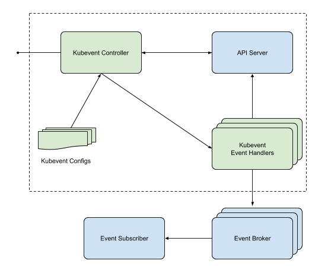

# Kubevent

Publish K8s events of builtin or custom resource objects (CRD) from K8s clusters to external event brokers.

## Goals

- Register resource events to subscribe
- Publish the registered resource events to external event brokers
- Support metrics of registered resource events and published events
- Support extensible event brokers

## Non-Goals
- Message queue implementation
- Event broker implementation

## Architecture

### Kubevent Controller

**Kubevent Controller** is responsible for watching user registered resource events, managing **Kubevent Event Publisher** to serve publishing events with resource data to external connected event brokers.

### Kubevent Configs

**Kubeevent Configs** provides a declarative way to configure registered events, connected event broker and others to Kubevent controller to apply.

### Kubevent Event Publisher

**Kubevent Event Publisher** will be dynamically scaled to serve event publishing according to workloads.

## Supported Items

### Resource
Builtin K8s resource or CRD.

### Event

Resource with kube verb (ex: get, list, watch, create, update, patch, delete, delete collection, and prox) and resource data

### Event Broker

- Apache Kafka
- NATS
- AMQP (Advanced Message Queuing Protocol)
- STOMP (Simple Text Oriented Messaging Protocol)
- MQTT (Message Queuing Telemetry Transport)
- STOMP over WebSocket 
- Webhook
- Cloud solutions
  - AWS MQ, SQS (SImple Queue Service), Kinesis
  - Azure Service Bus, Event Grid, Event Hubs
  - GCP Cloud Pub/Sub
